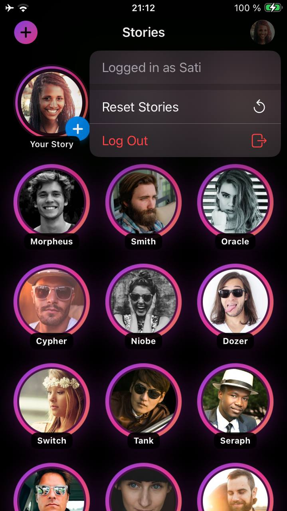
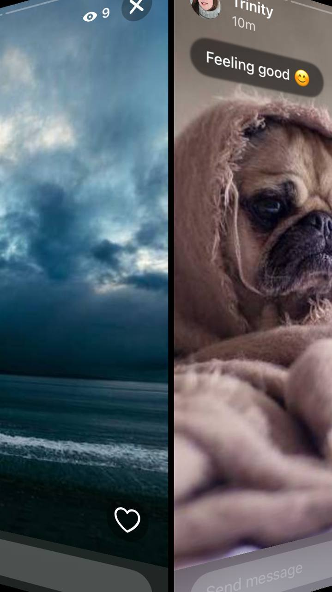

# Instagram Stories Clone

iOS app demonstrating Instagram-style stories with camera, reactions, and state persistence.

Disclaimer : this app is mostly vibe-coded - my focus was on the UX to make this social app with fake users less lonely and exciting.

## Demo

### Video Walkthrough


### Screenshots

<p align="center">
  
  
  
</p>

<p align="center">
  
  
</p>

Emphasis was put on micro animation / gestures
- floating bubbles in the story list view
- pull moving around when new content is posted
- Micro animation on heart touch then reactions trigering emojis shower
- 3-D Rotation to swipe from/to user
- Closing story by swiping down

## Features

**Story Viewing**
- Story list with visual seen/unseen indicators (gradient vs gray rings)
- Full-screen viewer with auto-advance timer
- Instagram-style gestures (tap left/right, swipe down, long-press pause)
- Horizontal scroll between users with 3D transitions (tough one)
- Viewer count and list (view count is faked)

**Interactions**
- 6 reaction types (❤️ 😂 😮 😢 😡 👍) with animated feedback
- Reply input bar (faked)
- Haptic feedback throughout (login, pull to refresh, ...)

**Creation**
- AVFoundation camera with front/back switching - but please don't switch while filming :-)
- 6 Image simple filters 
- Simple Caption support
- Text that can be moved around

**State Management**
- Per-story, per-user viewed tracking
- Persistent state across app restarts (UserDefaults)
- Resume from first unviewed story
- Pull-to-refresh for new content

**Performance**
- Aggressive image preloading (5-7 stories ahead)
- Priority-based loading queue
- LRU cache (40 images, 8 concurrent)

## Architecture

```
Domain/     - Business logic (models, protocols, services)
Data/       - Data sources and persistence
Presentation/ - SwiftUI views, ViewModels, utilities
```

MVVM pattern with clean architecture principles.

## Tech Stack

- Swift 5.9+, SwiftUI, iOS 17.0+
- AVFoundation (camera), Core Image (filters)
- No external dependencies

## Running

Login as any user ID 1-20. App clears data on launch for demo purposes.

## Trade-offs

**Not Implemented**
- Backend API (using mock data)
- Actual view count
- Upload from device (camera prefered)
- Tests (would add in production)
- Error handling UI
- Proper Network & Error management

Lot of shortcuts were taken - like Stories data structure remembered which users viewed each Story.
